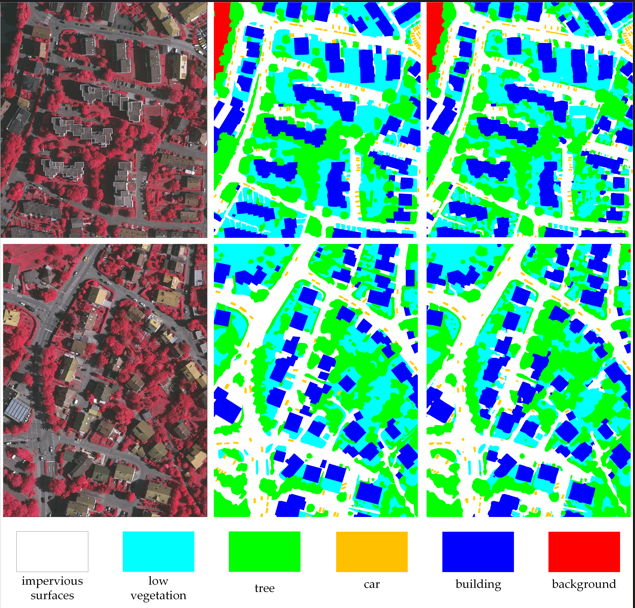
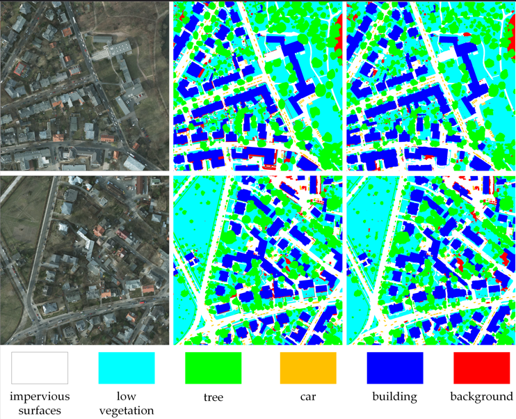

## Version 1.0 (stable)

[Welcome to my homepage!](https://kolbey.github.io/)

## Notice 
- Pretrained Weights can be access from [Google Drive](https://drive.google.com/drive/folders/1ELpFKONJZbXmwB5WCXG7w42eHtrXzyPn?usp=sharing)

- ISPRS Vaihingen and Potsdam datasets are supported. Since private sharing is not allowed, you need to download the datasets from the official website and split them by **Folder Structure**.

- More network are updated and the link of pretrained weights is provided.

- **config/loveda/dcswin.py** provides a detailed explain about **config** setting.

- Inference on huge RS images are supported (inference_huge_image.py).

## Introduction

**ISUS_Seg** is an open-source  semantic segmentation toolbox based on PyTorch, [pytorch lightning](https://www.pytorchlightning.ai/) and [timm](https://github.com/rwightman/pytorch-image-models), 
which mainly focuses on developing advanced Vision Transformers for remote sensing image segmentation.


## Major Features

- Unified Benchmark

  we provide a unified training script for various segmentation methods.
  
- Simple and Effective

  Thanks to **pytorch lightning** and **timm** , the code is easy for further development.
  
- Supported Remote Sensing Datasets
  
  - [TAS](https://codalab.lisn.upsaclay.fr/competitions/5637#learn_the_details)
  - [UAVid](https://uavid.nl/)
  - [FLAIR](https://codalab.lisn.upsaclay.fr/competitions/8769)
  - [INRIA](https://project.inria.fr/aerialimagelabeling/)
  - [LoveDA](https://codalab.lisn.upsaclay.fr/competitions/421)
  - [ISPRS Vaihingen](https://www.isprs.org/education/benchmarks/UrbanSemLab/default.aspx) 
  - [ISPRS Potsdam](https://www.isprs.org/education/benchmarks/UrbanSemLab/default.aspx)
  - More datasets will be supported in the future.
  
- Multi-scale Training and Testing
- Inference on Huge Remote Sensing Images
- Supervision Training and Contrastive Training

## Supported Networks

- Vision Transformer

  - [BANet](https://www.mdpi.com/2072-4292/13/16/3065)
  - [DC-Swin](https://ieeexplore.ieee.org/abstract/document/9681903)
  - [Segformer](https://arxiv.org/abs/2105.15203)
  - [DAE-Former](https://arxiv.org/pdf/2212.13504v1.pdf)
  - [BuildFormer](https://arxiv.org/abs/2111.15637)
  - [UNetFormer](https://authors.elsevier.com/a/1fIji3I9x1j9Fs) 
  - [FTUNetFormer](https://authors.elsevier.com/a/1fIji3I9x1j9Fs)
  - [FTUNetFormer_Contrastive](https://arxiv.org/pdf/2101.11939.pdf)
  
- CNN

  - [Unet++](https://arxiv.org/abs/1807.10165)
  - [MANet](https://ieeexplore.ieee.org/abstract/document/9487010) 
  - [ABCNet](https://www.sciencedirect.com/science/article/pii/S0924271621002379)
  - [A2FPN](https://www.tandfonline.com/doi/full/10.1080/01431161.2022.2030071)
  - [DeepLabv3+](https://arxiv.org/abs/1802.02611)
  
## Folder Structure

Prepare the following folders to organize this repo:
```none
ISUS_Seg
├── config (training setting)
├── fig_results (save the masks predicted by models)
├── geoseg (model, dataset and loss)
├── inference (testing the training results)
├── model_weights (save the model weights)
├── pretrain_weights (save the pretrained weights like vit, swin, etc)
├── tensorboard_logs (tensorboard format training logs)
├── tools (preprocessing the data)
├── utils (useful toolkit)
├── data
│   ├── LoveDA
│   │   ├── Train
│   │   │   ├── Urban
│   │   │   │   ├── images_png (original images)
│   │   │   │   ├── masks_png (original masks)
│   │   │   │   ├── masks_png_convert (converted masks used for training)
│   │   │   │   ├── masks_png_convert_rgb (original rgb format masks)
│   │   │   ├── Rural
│   │   │   │   ├── images_png 
│   │   │   │   ├── masks_png 
│   │   │   │   ├── masks_png_convert
│   │   │   │   ├── masks_png_convert_rgb
│   │   ├── Val (the same with Train)
│   │   ├── Test
│   │   ├── train_val (Merge Train and Val)
│   ├── uavid
│   │   ├── uavid_train (original)
│   │   ├── uavid_val (original)
│   │   ├── uavid_test (original)
│   │   ├── uavid_train_val (Merge uavid_train and uavid_val)
│   │   ├── train (processed)
│   │   ├── val (processed)
│   │   ├── train_val (processed)
│   ├── vaihingen
│   │   ├── train_images (original)
│   │   ├── train_masks (original)
│   │   ├── test_images (original)
│   │   ├── test_masks (original)
│   │   ├── test_masks_eroded (original)
│   │   ├── train (processed)
│   │   ├── test (processed)
│   ├── potsdam (the same with vaihingen)
```

## Install

Git the project **ISUS_Seg** using **Linux Terminal** and create python environment:
```
conda create -n OMGD python=3.8
conda activate OMGD

conda install pytorch==1.10.0 torchvision==0.11.0 torchaudio==0.10.0 cudatoolkit=11.3 -c pytorch -c conda-forge
pip install -r ISUS_Seg/requirements.txt
```

## Pretrained Weights

[Baidu Disk](https://pan.baidu.com/s/1foJkxeUZwVi5SnKNpn6hfg) : 1234 

[Google Drive](https://drive.google.com/drive/folders/1ELpFKONJZbXmwB5WCXG7w42eHtrXzyPn?usp=sharing)

## Data Preprocessing

Download the datasets from the official website and split them yourself.

**Vaihingen**

Generate the training set.
```
python ISUS_Seg/tools/vaihingen_patch_split.py \
--img-dir "data/vaihingen/train_images" \
--mask-dir "data/vaihingen/train_masks" \
--output-img-dir "data/vaihingen/train/images_1024" \
--output-mask-dir "data/vaihingen/train/masks_1024" \
--mode "train" --split-size 1024 --stride 512 
```
Generate the testing set.
```
python ISUS_Seg/tools/vaihingen_patch_split.py \
--img-dir "data/vaihingen/test_images" \
--mask-dir "data/vaihingen/test_masks_eroded" \
--output-img-dir "data/vaihingen/test/images_1024" \
--output-mask-dir "data/vaihingen/test/masks_1024" \
--mode "val" --split-size 1024 --stride 1024 \
--eroded
```
Generate the masks_1024_rgb (RGB format ground truth labels) for visualization.
```
python ISUS_Seg/tools/vaihingen_patch_split.py \
--img-dir "data/vaihingen/test_images" \
--mask-dir "data/vaihingen/test_masks" \
--output-img-dir "data/vaihingen/test/images_1024" \
--output-mask-dir "data/vaihingen/test/masks_1024_rgb" \
--mode "val" --split-size 1024 --stride 1024 \
--gt
```
As for the validation set, you can select some images from the training set to build it.

**Potsdam**
```
python ISUS_Seg/tools/potsdam_patch_split.py \
--img-dir "data/potsdam/train_images" \
--mask-dir "data/potsdam/train_masks" \
--output-img-dir "data/potsdam/train/images_1024" \
--output-mask-dir "data/potsdam/train/masks_1024" \
--mode "train" --split-size 1024 --stride 1024 --rgb-image 
```

```
python ISUS_Seg/tools/potsdam_patch_split.py \
--img-dir "data/potsdam/test_images" \
--mask-dir "data/potsdam/test_masks_eroded" \
--output-img-dir "data/potsdam/test/images_1024" \
--output-mask-dir "data/potsdam/test/masks_1024" \
--mode "val" --split-size 1024 --stride 1024 \
--eroded --rgb-image
```

```
python ISUS_Seg/tools/potsdam_patch_split.py \
--img-dir "data/potsdam/test_images" \
--mask-dir "data/potsdam/test_masks" \
--output-img-dir "data/potsdam/test/images_1024" \
--output-mask-dir "data/potsdam/test/masks_1024_rgb" \
--mode "val" --split-size 1024 --stride 1024 \
--gt --rgb-image
```

**UAVid**
```
python ISUS_Seg/tools/uavid_patch_split.py \
--input-dir "data/uavid/uavid_train_val" \
--output-img-dir "data/uavid/train_val/images" \
--output-mask-dir "data/uavid/train_val/masks" \
--mode 'train' --split-size-h 1024 --split-size-w 1024 \
--stride-h 1024 --stride-w 1024
```

```
python ISUS_Seg/tools/uavid_patch_split.py \
--input-dir "data/uavid/uavid_train" \
--output-img-dir "data/uavid/train/images" \
--output-mask-dir "data/uavid/train/masks" \
--mode 'train' --split-size-h 1024 --split-size-w 1024 \
--stride-h 1024 --stride-w 1024
```

```
python ISUS_Seg/tools/uavid_patch_split.py \
--input-dir "data/uavid/uavid_val" \
--output-img-dir "data/uavid/val/images" \
--output-mask-dir "data/uavid/val/masks" \
--mode 'val' --split-size-h 1024 --split-size-w 1024 \
--stride-h 1024 --stride-w 1024
```

**LoveDA**
```
python ISUS_Seg/tools/loveda_mask_convert.py --mask-dir data/LoveDA/Train/Rural/masks_png --output-mask-dir data/LoveDA/Train/Rural/masks_png_convert
python ISUS_Seg/tools/loveda_mask_convert.py --mask-dir data/LoveDA/Train/Urban/masks_png --output-mask-dir data/LoveDA/Train/Urban/masks_png_convert
python ISUS_Seg/tools/loveda_mask_convert.py --mask-dir data/LoveDA/Val/Rural/masks_png --output-mask-dir data/LoveDA/Val/Rural/masks_png_convert
python ISUS_Seg/tools/loveda_mask_convert.py --mask-dir data/LoveDA/Val/Urban/masks_png --output-mask-dir data/LoveDA/Val/Urban/masks_png_convert
```

## Training

"-c" means the path of the config, use different **config** to train different models.

```
python ISUS_Seg/train_supervision.py -c ISUS_Seg/config/uavid/unetformer.py
```

```
python ISUS_Seg/train_contrastive.py -c ISUS_Seg/config/flair/contrastive/ftunetformer.py
```

## Testing

"-c" denotes the path of the config, Use different **config** to test different models. 

"-o" denotes the output path 

"-t" denotes the test time augmentation (TTA), can be [None, 'lr', 'd4'], default is None, 'lr' is flip TTA, 'd4' is multiscale TTA

"--rgb" denotes whether to output masks in RGB format

**Vaihingen**
```
python ISUS_Seg/inference/vaihingen/vaihingen_test.py -c ISUS_Seg/config/vaihingen/dcswin.py -o ISUS_Seg/fig_results/vaihingen/dcswin --rgb -t 'd4'
```

**Potsdam**
```
python ISUS_Seg/inference/potsdam/potsdam_test.py -c ISUS_Seg/config/potsdam/dcswin.py -o ISUS_Seg/fig_results/potsdam/dcswin --rgb -t 'lr'
```

**LoveDA** ([Online Testing](https://codalab.lisn.upsaclay.fr/competitions/421))
```
python ISUS_Seg/inference/loveda/loveda_test.py -c ISUS_Seg/config/loveda/dcswin.py -o ISUS_Seg/fig_results/loveda/dcswin_test -t 'd4'
```

**UAVid** ([Online Testing](https://codalab.lisn.upsaclay.fr/competitions/7302))
```
python ISUS_Seg/inference/uavid/uavid_test.py \
-i 'data/uavid/uavid_test' \
-c ISUS_Seg/config/uavid/unetformer.py \
-o ISUS_Seg/fig_results/uavid/unetformer_r18 \
-t 'lr' -ph 1152 -pw 1024 -b 2 -d "uavid"
```

## Inference on huge remote sensing image
```
python ISUS_Seg/inference/inference_huge_image.py \
-i data/vaihingen/test_images \
-c ISUS_Seg/config/vaihingen/dcswin.py \
-o ISUS_Seg/fig_results/vaihingen/dcswin_huge \
-t 'lr' -ph 512 -pw 512 -b 2 -d "pv"
```

<div>


</div>

## Reproduction Results
|    Method     |  Dataset  |  F1   |  OA   |  mIoU |
|:-------------:|:---------:|:-----:|:-----:|------:|
|  UNetFormer   |   UAVid   |   -   |   -   | 67.63 |
|  UNetFormer   | Vaihingen | 90.30 | 91.10 | 82.54 |
|  UNetFormer   |  Potsdam  | 92.64 | 91.19 | 86.52 |
|  UNetFormer   |  LoveDA   |   -   |   -   | 52.97 |
| FT-UNetFormer | Vaihingen | 91.17 | 91.74 | 83.98 |
| FT-UNetFormer |  Potsdam  | 93.22 | 91.87 | 87.50 |

Due to some random operations in the training stage, reproduced results (run once) are slightly different from the reported in paper.

## Acknowledgement

We wish **ISUS_Seg** could serve the growing research of remote sensing by providing a unified benchmark 
and inspiring researchers to develop their own segmentation networks. Many thanks the following projects's contributions to **ISUS_Seg**.

- [timm](https://github.com/rwightman/pytorch-image-models)
- [ttach](https://github.com/qubvel/ttach)
- [catalyst](https://github.com/catalyst-team/catalyst)
- [GeoSeg](https://github.com/WangLibo1995/GeoSeg)
- [pytorch lightning](https://www.pytorchlightning.ai/)
- [pytorch-toolbelt](https://github.com/BloodAxe/pytorch-toolbelt)
- [mmsegmentation](https://github.com/open-mmlab/mmsegmentation)